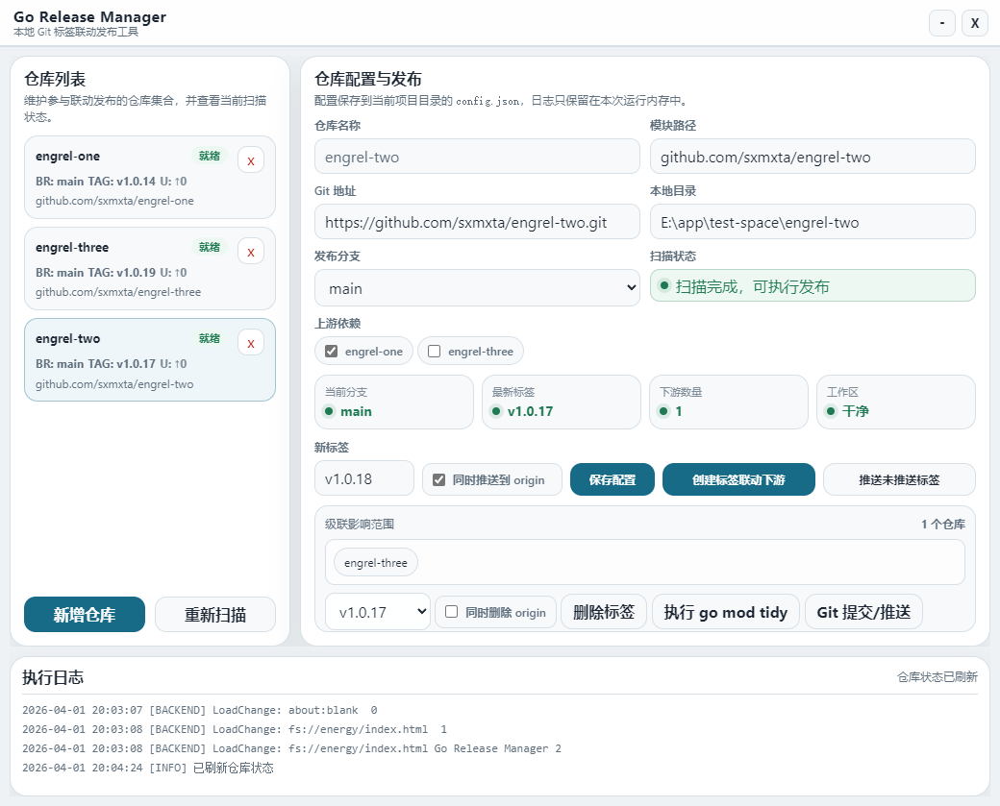

# Go Release Manager

---

<div align="center">
一个专为 **Go 项目多模块依赖管理** 打造的可视化工具，帮助你轻松完成版本更新、依赖同步与 Git 操作。

自动化管理 Go 模块依赖版本更新与级联发布

[](https://golang.org)
[](LICENSE)
[](README.md)

</div>

---



---

## 📖 项目简介

Go Release Manager 是一款专为 Go 多模块项目设计的**自动化版本发布工具**。它通过 Git 标签触发机制，智能处理模块间的依赖关系，实现
**一次打 tag，自动联动更新所有下游仓库**的现代化发布流程。

### ✨ 核心特性

- 🔄 **级联发布** - 基于依赖关系图自动计算影响范围，按层级顺序更新
- 🏷️ **语义化版本** - 遵循 SemVer 规范（v1.2.3），支持版本号自动递增
- 🔍 **依赖检测** - 自动扫描 go.mod 文件识别模块依赖关系
- ✅ **验证机制** - 执行 `go mod tidy` 并验证 go.sum 同步成功，支持重试
- 📊 **可视化界面** - 基于 Energy 框架的跨平台 GUI，操作直观友好
- 🛡️ **安全可靠** - 原子性推送分支和标签，支持本地/远端双重操作
- 📝 **实时日志** - 详细的操作日志输出，支持调试和审计

---

## 🎯 适用场景

### 典型的多模块项目结构

**依赖关系：** `energy > cef, wv > lcl`

### 使用效果

当 `lcl` 仓库创建新标签 `v1.0.1` 时：

1. ✅ 自动检测依赖 `lcl` 的所有仓库（cef、wv、energy）
2. ✅ 按依赖层级依次更新 go.mod 中的依赖版本
3. ✅ 执行 `go mod tidy` 同步依赖并验证
4. ✅ 为每个受影响的仓库创建新的补丁版本标签
5. ✅ 可选推送到远程仓库 origin

---

## 🚀 快速开始

### 环境要求

- **Go**: 1.20 或更高版本
- **Git**: 已配置并添加到系统 PATH
- **操作系统**: Windows / macOS / Linux
- **ENERGY Designer**: GUI 设计器, 它会自动更新 energy 的 Go 依赖模块
- **克隆 designer**
```cmd
git clone https://github.com/energye/designer.git
cd designer
go mod tidy
go run main.go
```

### 运行go-release-manager
- **克隆 go-release-manager**
```cmd
git clone https://github.com/sxmxta/go-release-manager.git
```
- 使用 designer 打开 go-release-manager 项目文件 go-release-manager.egp

---

## 📋 功能说明

### 主要功能模块

#### 1. 仓库管理

- ➕ **新增仓库** - 创建仓库条目，配置基本信息
- 🗑️ **删除仓库** - 移除仓库配置并清理依赖关系
- 🔄 **重新扫描** - 刷新所有仓库的状态（分支、标签、依赖）
- 📌 **选择仓库** - 切换当前操作的仓库上下文

#### 2. 配置项

| 字段     | 说明             | 示例                                 |
|--------|----------------|------------------------------------|
| 仓库名称   | 唯一标识符          | `lcl`, `cef`, `wv`                 |
| Git 地址 | 远程仓库 URL       | `https://github.com/user/repo.git` |
| 本地目录   | 本地路径           | `E:/repo/energy-lcl`               |
| 模块路径   | Go module path | `github.com/user/lcl`              |
| 发布分支   | 目标分支名          | `main`, `master`                   |
| 上游依赖   | 依赖的其他仓库        | 多选框勾选                              |

#### 3. 发布操作

- 🏷️ **创建标签联动下游** - 为当前仓库打 tag 并级联更新所有下游仓库
- 📤 **推送未推送标签** - 批量推送本地标签到远端 origin
- 🗑️ **删除标签** - 删除本地/远端标签（可选是否包含 origin）
- 🔧 **执行 go mod tidy** - 手动刷新模块依赖

#### 4. Git 操作

- ✏️ **提交当前改动** - 暂存并提交工作区变更
- 📤 **推送当前分支** - 推送当前分支到远端

---

## 🔧 配置说明

### config.json 配置文件

程序会自动读取项目根目录的 `config.json` 文件：

```json
{
  "repos": [
    {
      "name": "lcl",
      "remoteUrl": "https://github.com/energye/lcl.git",
      "localDir": "E:/repo/lcl",
      "modulePath": "github.com/energye/lcl",
      "releaseBranch": "main",
      "dependencies": [],
      "dependenciesManual": true
    },
    {
      "name": "cef",
      "remoteUrl": "https://github.com/energye/cef.git",
      "localDir": "E:/repo/cef",
      "modulePath": "github.com/energye/cef",
      "releaseBranch": "main",
      "dependencies": [
        "lcl"
      ],
      "dependenciesManual": true
    },
    {
      "name": "energy",
      "remoteUrl": "https://github.com/energye/energy.git",
      "localDir": "E:/repo/energy",
      "modulePath": "github.com/energye/energy",
      "releaseBranch": "main",
      "dependencies": [
        "cef",
        "wv",
        "lcl"
      ],
      "dependenciesManual": true
    }
  ],
  "selectedRepo": "lcl"
}
```

### 配置项详解

- **dependenciesManual**:
  - `true`: 手动维护依赖关系
  - `false`: 自动从 go.mod 检测依赖

---

## 💡 使用示例

### 场景 1: 基础库版本更新

**背景**: `lcl` 库修复了 bug，需要发布 `v1.0.1`

**操作流程**:
1. 选择仓库 `lcl`
2. 输入新标签 `v1.0.1`
3. 勾选"同时推送到 origin"
4. 点击"创建标签联动下游"
5. 确认级联影响范围（cef、wv、energy）
6. 等待自动完成所有仓库的更新

**结果**:
- ✅ `lcl` → `v1.0.1`
- ✅ `cef` → `vX.Y.Z+1` (自动升级补丁版本)
- ✅ `wv` → `vX.Y.Z+1`
- ✅ `energy` → `vX.Y.Z+1`

### 场景 2: 中间层库更新

**背景**: `cef` 库新增功能，发布 `v2.0.0`

**影响范围**: 仅 `energy` 仓库需要更新

**流程**: 同上，系统自动识别只有 energy 依赖 cef

### 场景 3: 删除错误标签

**背景**: 误操作创建了错误标签

**操作流程**:
1. 选择对应仓库
2. 在下拉框选择要删除的标签
3. 勾选"同时删除 origin"（如需删除远端）
4. 点击"删除标签"
5. 确认删除操作

---

### 关键技术点

1. **依赖图构建**: 使用反向图算法计算级联影响范围
2. **层级排序**: BFS 广度优先搜索确定发布顺序
3. **事务安全**: 原子性操作确保分支和标签一致性
4. **重试机制**: `go mod tidy` 失败时指数退避重试（最多 3 次）
5. **验证机制**: 检查 go.sum 文件确保依赖同步成功

---

## 🔐 注意事项

### ⚠️ 重要提示

1. **备份代码**: 执行发布前请确保所有本地改动已提交
2. **网络稳定**: 推送远端时需要稳定的网络连接
3. **标签格式**: 必须遵循 `v主版本。次版本。补丁版本` 格式（如 v1.2.3）
4. **工作区干净**: 建议在执行发布前保持工作区干净（无未提交改动）
5. **go.mod 完整**: 确保所有仓库都有有效的 go.mod 文件

### 📌 最佳实践

- 在发布前先用"重新扫描"功能刷新仓库状态
- 首次使用建议先在测试仓库验证流程
- 定期备份 config.json 配置文件
- 关注执行日志，发现异常及时处理

---


### 贡献代码

欢迎提交 Issue 和 Pull Request！

1. Fork 本项目
2. 创建功能分支 (`git checkout -b feature/AmazingFeature`)
3. 提交变更 (`git commit -m 'Add some AmazingFeature'`)
4. 推送到分支 (`git push origin feature/AmazingFeature`)
5. 提交 Pull Request

---

## 📄 开源协议

本项目采用 MIT 协议开源 - 查看 [LICENSE](LICENSE) 文件了解详情

---

##  开源项目

- [Energy Framework](https://github.com/energye/energy) - 跨平台应用框架
- [LCL](https://github.com/energye/lcl) - 基础组件库

---

## 📞 联系方式

- **问题反馈**: 请在 GitHub Issues 中提交
- **技术支持**: 项目讨论区

---

<div align="center">

**如果这个项目对你有帮助，请给一个 ⭐ Star 支持！**

Made with ❤️ by ENERGY Team

</div>
